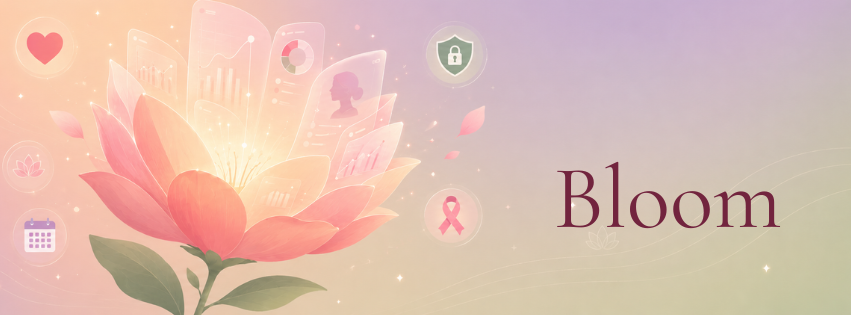

<div align="center">
<p align="center">
  
</p>


# Bloom

### Women's health at work, powered by Microsoft Foundry.

*From invisible workplace struggles to supported journeys.*

[](https://learn.microsoft.com/azure/ai-foundry/)
[](https://learn.microsoft.com/agent-framework/)
[](LICENSE)
[](https://microsoft.github.io/AI_Agents_Hackathon/)

[**The problem**](#the-problem) · [**The solution**](#the-solution) · [**Architecture**](#architecture) · [**Quick start**](#quick-start) · [**Deployment**](#deployment) · [**The team**](#the-team)

</div>

---

## The problem

Women's health remains one of the most under-addressed challenges in the modern workplace.

- **1 in 6 women** has considered leaving her job due to lack of menopause support (CIPD, 2023)
- **72% of employees** would stay longer at a company that proactively supports fertility (Fertility Matters at Work)
- **$1.8 billion per year** in US productivity losses from menopause alone (Mayo Clinic / AARP, 2025)
- **190 million women** worldwide live with endometriosis, with an average **7-to-10 year** diagnostic delay (WHO, 2024)
- **2.3 million** new breast cancer cases per year, where regular screening reduces mortality by **20-35%** (WHO/IARC GLOBOCAN, 2022)

The root cause is not medical — it is structural. Women don't talk about these issues at work because they fear judgment, stigma, or career consequences. Existing health apps are personal tools, disconnected from the workplace. HR departments want to act but lack the data, the policies, and the training to do so effectively.

**Bloom bridges that gap: a health benefit provided by the employer, never seen by the employer.**

---

## The solution

Bloom is an **agentic application** that helps women manage the full spectrum of their health at work — menstrual cycle, conception, menopause, breast screening, and intensive treatment recovery — through five specialized AI agents coordinated by an orchestrator, with a dedicated HR Policy agent on the other side of a strict confidentiality wall.

### Two faces, one product

<table>
<tr>
<th width="50%">👤 Employee face</th>
<th width="50%">👔 HR face</th>
</tr>
<tr>
<td valign="top">

A fully confidential health companion accessible inside Microsoft Teams.

- 5 specialized modules + orchestrator (6 agents)
- Voice-first, plain-language responses
- Every claim grounded with citations
- Calendar protection with propose/execute pattern
- Longitudinal memory across life stages

</td>
<td valign="top">

An HR Policy Agent that turns anonymous signals into action.

- Anonymized insights only (k-anonymity, k ≥ 20)
- Tailored policy generation (charters, action plans)
- Manager training simulations
- Sector benchmarking
- Compliance tracking (Rist Report, EmpCo, etc.)

</td>
</tr>
</table>

### Why agentic?

Bloom uses **multi-step reasoning** that cross-references three knowledge bases for every answer. When an employee says *"I have egg retrieval Thursday but a board meeting at 10"*, the Conception agent reasons across:

1. **Medical guidelines** (ESHRE) → rest is recommended after egg retrieval
2. **Labor law** (Code du travail L.1225-16) → paid absence is a legal right
3. **Company policy** (collective agreement, article 12) → short-notice remote work is available

Then it proposes a concrete plan, drafts a neutral absence email, and offers calendar protection — without ever revealing the medical reason. This is exactly what the **Reasoning Agents** track of the Microsoft Hackathon rewards.

---

## Architecture

### High-level

```
Microsoft Teams ──► React SPA (App Service) ──► FastAPI (App Service)
                                                       │
                                                       ▼
                                  Microsoft Agent Framework
                                  ┌────────────────────────┐
                                  │ Employee project       │
                                  │ ┌────────────────────┐ │
                                  │ │ Orchestrator       │ │
                                  │ ├────────────────────┤ │
                                  │ │ Cycle | Conception │ │
                                  │ │ Menopause | Breast │ │
                                  │ │ Treatment          │ │
                                  │ └────────────────────┘ │
                                  └──────────┬─────────────┘
                                             │
                                  ╔══════════════════════════╗
                                  ║ confidentiality wall     ║
                                  ║ (Azure RBAC enforced)    ║
                                  ╚══════════════════════════╝
                                             │
                                  ┌──────────┴─────────────┐
                                  │ HR project             │
                                  │ ┌────────────────────┐ │
                                  │ │ Policy Agent       │ │
                                  │ └────────────────────┘ │
                                  └──────────┬─────────────┘
                                             │
                                             ▼
                              Foundry IQ (3 knowledge bases)
                              ┌──────────┬──────────┬──────────┐
                              │ Medical  │ Legal    │ Company  │
                              │ WHO/NICE │ L.1225-16│ agreements│
                              └──────────┴──────────┴──────────┘
                                             │
                                             ▼
                              Cosmos DB (employee-memory ‖ hr-aggregates)
                              [separated by RBAC role assignments]
```

### Why two Foundry projects?

This is Bloom's architectural signature. The Employee and HR agents run in **separate Foundry projects** with distinct managed identities and Azure RBAC scopes. This means:

- The HR Policy Agent **cannot read** any individual employee's conversation, symptom, or appointment
- An Azure audit log can **prove** the wall is enforced, not just claim it
- Compliance reviews can verify the isolation without trusting the application code

The confidentiality wall is observable in the Azure portal, not just promised in a privacy policy.

### Calendar protection — propose, never act alone

For sensitive medical events (chemotherapy, IVF retrievals, mammograms), Bloom can proactively block calendar slots — but never automatically.

```
1. PROPOSE  →  Read-only tool, computes slots and detects conflicts
                ↓
2. CONFIRM  →  Agent presents the plan, asks "Shall I block these slots?"
                ↓
3. EXECUTE  →  Only after explicit user "yes", writes via Microsoft Graph
                Under the USER's delegated identity (OBO flow)
                Title: "Unavailable" | Sensitivity: private
```

The two-step pattern is enforced structurally — `propose_calendar_blocks` and `execute_calendar_blocks` are separate tools, and the execution tool requires the exact slots returned by the proposal. Even if the model hallucinates, it cannot bypass the checkpoint.

---

## Project structure

```
bloom/
├── bloom-app/                        # React + Vite frontend (Teams tab)
│   ├── src/
│   │   ├── components/               # TopBar, ChatArea, ModuleNav, ...
│   │   ├── data/                     # Modules definition + mock responses
│   │   ├── styles/                   # Design tokens + global CSS
│   │   ├── App.jsx
│   │   └── main.jsx
│   ├── public/                       # bloom-logo.png, favicon
│   ├── index.html
│   ├── package.json
│   └── vite.config.js
│
├── bloom-backend/                    # FastAPI backend + Microsoft Agent Framework
│   ├── app/
│   │   ├── agents/
│   │   │   ├── orchestrator.py       # Handoff routing
│   │   │   ├── modules.py            # Cycle | Conception | Menopause | Breast | Treatment
│   │   │   ├── policy.py             # HR Policy agent (separate Foundry project)
│   │   │   ├── tools.py              # AIFunctions (email, reminders, finder)
│   │   │   └── calendar_tools.py     # Propose/execute pattern
│   │   ├── routers/
│   │   │   ├── chat.py               # POST /api/v1/chat (employee)
│   │   │   ├── hr.py                 # GET /api/v1/hr/insights + POST /policy
│   │   │   └── auth.py               # Entra ID + Teams SSO + OBO
│   │   ├── services/
│   │   │   ├── foundry_iq.py         # Knowledge base context providers
│   │   │   ├── memory.py             # Cosmos DB (employee + HR containers)
│   │   │   ├── calendar.py           # Microsoft Graph integration
│   │   │   └── auth_context.py       # Delegated token management
│   │   ├── models/schemas.py         # Pydantic contracts
│   │   ├── config.py
│   │   └── main.py                   # FastAPI entry point
│   ├── infra/
│   │   ├── main.bicep                # Full Azure infrastructure as code
│   │   └── seed_hr_aggregates.py     # HR dashboard seed data
│   ├── docs/
│   │   ├── bloom-deployment-guide.md
│   │   └── demo_calendar_flow.py     # Two-turn conversation script
│   └── requirements.txt
│
├── docs/
│   ├── screenshots/                  # UI captures used in README
│   └── bloom-project-description.md  # Full hackathon submission description
│
├── .gitignore
├── README.md
└── LICENSE
```

---

## Tech stack

| Layer | Technology |
|---|---|
| **Frontend** | React 18, Vite, Lucide icons, Cormorant Garamond + Inter |
| **Backend** | Python 3.12, FastAPI, Pydantic v2, Uvicorn + Gunicorn |
| **Agent orchestration** | Microsoft Agent Framework 1.0 GA — handoff pattern |
| **AI runtime** | Microsoft Foundry Agent Service, Azure OpenAI (gpt-4o) |
| **Knowledge layer** | Foundry IQ (3 KBs) + Web IQ, backed by Azure AI Search |
| **Voice** | MAI-Transcribe-2 (STT) + MAI-Voice-2 (TTS) |
| **Integration** | Microsoft Graph (Calendar.ReadWrite delegated), Teams SSO + OBO |
| **Data** | Cosmos DB serverless — 2 containers with distinct RBAC |
| **Security** | Entra ID, Managed Identity (no API keys), Key Vault |
| **Hosting** | Azure App Service (Linux Python + Node), Application Insights |
| **IaC** | Bicep — full stack deployable in one command |
| **Compliance** | WCAG 2.2 AA, EN 301 549, GDPR-ready architecture |

---

## Quick start

### Frontend only (mock responses, ideal for testing the UX)

```bash
cd bloom-app
npm install
npm run dev
```

Open [http://localhost:5173](http://localhost:5173).

The frontend ships with mocked agent responses in `src/data/responses.js`, so you can explore all five modules without needing to deploy any Azure resources. Perfect for the demo video.

### Backend (requires Azure access)

```bash
cd bloom-backend

# Set up Python environment
python -m venv .venv
source .venv/bin/activate  # On Windows: .\.venv\Scripts\Activate.ps1
pip install -r requirements.txt --pre

# Configure environment (see .env.sample)
cp .env.sample .env
# Edit .env with your Foundry, Search, Cosmos endpoints

# Sign in to Azure for managed identity to work locally
az login

# Run the server
uvicorn app.main:app --reload --port 8000
```

Open [http://localhost:8000/docs](http://localhost:8000/docs) for the Swagger UI.

---

## Deployment

Bloom is deployed entirely on Azure using Infrastructure-as-Code (Bicep). The complete deployment process is documented in [`bloom-backend/docs/bloom-deployment-guide.md`](bloom-backend/docs/bloom-deployment-guide.md).

### One-command provisioning

```bash
az group create -n bloom-dev-rg -l swedencentral
az deployment group create -g bloom-dev-rg -f bloom-backend/infra/main.bicep -p env=dev
```

This single command creates:

- 1 Foundry Hub with 2 child projects (Employee + HR)
- 1 Azure AI Search (Foundry IQ backend)
- 1 Cosmos DB account with 2 RBAC-isolated containers
- 1 Blob Storage with 3 knowledge base containers
- 2 App Services (FastAPI backend + React frontend)
- Application Insights, Log Analytics, Key Vault
- All RBAC role assignments enforcing the confidentiality wall
- gpt-4o model deployment (30 TPM by default)

### Teams integration

Bloom is delivered as a Teams tab using a custom app manifest. See [`bloom-backend/docs/bloom-deployment-guide.md`](bloom-backend/docs/bloom-deployment-guide.md) Step 7 for the manifest template and packaging instructions.

---

## What Bloom does — in three scenarios

### Scenario 1 — Period pain made visible

> Employee: *"I have really painful periods — is this normal?"*

The Cycle agent grounds the answer in WHO Reproductive Health Guidelines and NICE NG73. It flags that **pain interfering with daily activities is not "just normal"** and may indicate endometriosis. It offers to draft a remote-work request, find a specialist nearby, or schedule a follow-up.

**Reasoning chain**: medical KB lookup → symptom severity classification → orientation toward action.

### Scenario 2 — IVF schedule × board meeting

> Employee: *"I have egg retrieval Thursday but a board meeting at 10."*

The Conception agent cross-references three sources simultaneously:
- **ESHRE IVF Guidelines** → rest recommended post-retrieval
- **Code du travail L.1225-16** → paid absence is a legal right
- **Company Agreement art. 12** → short-notice remote work is available

It then drafts a neutral absence email mentioning a "medical appointment" without specifying the nature — preserving the user's privacy while solving the logistical conflict.

**Reasoning chain**: 3-source grounding → constraint satisfaction → action (email draft).

### Scenario 3 — Chemotherapy with calendar protection

> Employee: *"I have chemo next Tuesday at 9am, I need 2 days to recover."*

The Treatment Recovery agent proposes blocking three days on the user's calendar with neutral titles and private sensitivity, detects a conflict with an existing 1:1, and waits for explicit confirmation. Once confirmed, it writes the blocks via Microsoft Graph **under the user's delegated identity** — so the employer cannot prove Bloom touched the calendar.

**Reasoning chain**: read calendar → propose plan with conflict detection → wait for confirmation → execute under user identity → suggest next-step actions.

---

## Multi-agent topology

| Agent | Project | Knowledge bases | Tools |
|---|---|---|---|
| **Orchestrator** | Employee | (routing only) | hand-off to module agents |
| **Cycle** | Employee | Medical, Legal, Company | draft_email, reminder, find_specialist, calendar (propose/execute) |
| **Conception** | Employee | Medical, Legal, Company | draft_email, reminder, find_specialist, calendar (propose/execute) |
| **Menopause** | Employee | Medical, Legal, Company | draft_email, reminder, find_specialist, calendar (propose/execute) |
| **Breast Health** | Employee | Medical, Legal, Company | reminder, find_specialist, screening_calculator, calendar |
| **Treatment Recovery** | Employee | Medical, Legal, Company | draft_email, reminder, find_specialist, calendar (propose/execute) |
| **HR Policy** | HR | Medical, Legal, Company | (no employee memory access) |

**7 agents total, across 2 Foundry projects, with the confidentiality wall enforced at Azure RBAC level.**

---

## Hackathon prize alignment

Bloom is designed to compete across multiple tracks of the Microsoft AI Agents Hackathon:

- **🧠 Reasoning Agents** — multi-step cross-source reasoning is the core differentiator
- **❤️ Hack for Good** — measurable impact on women's retention and well-being at work
- **♿ Accessibility** — voice-native I/O, plain language, WCAG 2.2 AA, multilingual (FR/EN/ES/AR)
- **🏆 Best Overall** — full vertical product with infrastructure, agents, frontend, and deployment

---

## Documentation

| Document | Purpose |
|---|---|
| [`docs/bloom-project-description.md`](docs/bloom-project-description.md) | Full hackathon submission description |
| [`bloom-backend/docs/bloom-deployment-guide.md`](bloom-backend/docs/bloom-deployment-guide.md) | End-to-end Azure deployment guide |
| [`bloom-backend/docs/demo_calendar_flow.py`](bloom-backend/docs/demo_calendar_flow.py) | Two-turn calendar protection conversation script |
| [`bloom-backend/README.md`](bloom-backend/README.md) | Backend-specific developer reference |

---

## Acknowledgments

This project was made possible by recent Microsoft platform innovations:

- **Microsoft Agent Framework 1.0 GA** — unifying Semantic Kernel and AutoGen into one SDK
- **Foundry IQ** — making knowledge grounding a first-class service with citations
- **Microsoft IQ platform** — the broader vision presented at Build 2026
- **Foundry Agent Service** — hosted, stateful agent runtime with built-in tracing

Health data sources used in the demo knowledge bases:

- WHO (World Health Organization) fact sheets and guidelines
- NICE (UK National Institute for Health and Care Excellence) guidelines
- ACOG (American College of Obstetricians and Gynecologists) practice bulletins
- ESHRE (European Society of Human Reproduction and Embryology) guidelines
- French Code du travail (Légifrance) for labor law references
- The Rist Report (April 2025) on menopause at work

---
